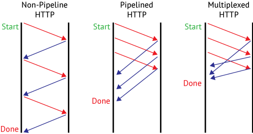

Gliederung
==========

1. Grundlagen
2. Geschichte
3. Funktionsweise HTTP
4. "Sitzungen"
5. TCP
6. SSL/TLS

Grundlagen
==========
- HTTP steht für Hypertext Transfer Protocol
- zustandsloses Protokoll
- Hauptsächlich für die Übertragung von Webseiten genutzt

Geschichte
==========

Funktionsweise HTTP
===================

Verbindungsaufbau
-----------------
1. Verbindungsaufbau über TCP
2. HTTP Anfrage
3. HTTP Antwort
4. Schließen der Verbindung

Funktionsweise HTTP
===================

Aufbau einer Anfrage
--------------------
\<Methode\> \<betreffende Resource\> \<Protokolversion\>\
\<HEADER\>\
Beispiel:\
\> GET /infotext.html HTTP/1.1\
\> Host: www.example.net

Funktionsweise HTTP
===================

HTTP-Anfragemethoden:
---------------------

- GET
- POST
- HEAD
- PUT
- PATCH
- DELETE
- TRACE
- OPTIONS
- CONNECT

Funktionsweise HTTP
===================

Aufbau einer Antwort
--------------------

Beispiel:\
> HTTP/1.1 200 OK \
> Server: Apache/1.3.29 (Unix) PHP/4.3.4 \
> Content-Length: 123456 (Größe von infotext.html in Byte) \
> Content-Language: de (nach RFC 3282 sowie RFC 1766) \
> Connection: close \
> Content-Type: text/html 

Funktionsweise HTTP
===================

Statuscodes
-----------

| Code | Bedeutung    |
|----|--------------|
| 1xx | Informationen |
| 2xx | Erfolgreiche Operation |
| 3xx | Umleitung |
| 4xx | Client-Fehler |
| 5xx | Server-Fehler |

Funktionsweise HTTP
===================

Mögliche Header Inhalte:
------------------------
- Host
- Content-Language
- Content-Type
- Date

Funktionsweise HTTP
==================

Typisches Beispiel
-----------------

"Sessions" mit HTTP
========================

- Cookies
- Wiederverwenden von TCP-Verbindung
- Pipelining (HTTP/1.1)
- Multiplexing (HTTP/2)

Vergleich
========

TCP
===

SSL/TLS
=======

- Verschlüsselung von HTTP -> HTTPS
- Arbeitet auf der Transportschicht (Transport Layer Security)

Aushandlung
=======

Quellen
======

https://19yw4b240vb03ws8qm25h366-wpengine.netdna-ssl.com/wp-content/uploads/load-master-multiplexing.png
https://developer.mozilla.org/en-US/docs/Web/HTTP/Overview
